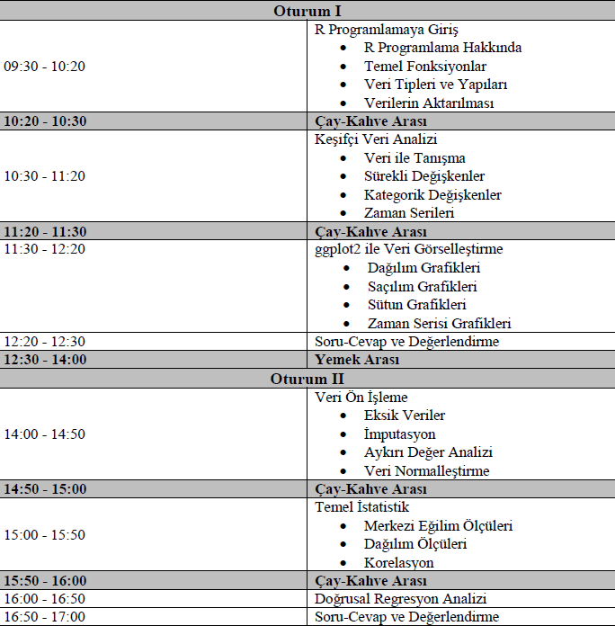

# R ile Veri Analizi Eğitimi 🎓

Bu Github reposu, 16 Mayıs 2025 tarihinde 6. Uluslararası Uygulamalı İstatistik Kongresi (UYİK-2025) kapsamında hazırlanan R ile Veri Analizi eğitimine ait sunum materyallerini içermektedir.

------------------------------------------------------------------------

## 🗓️ Ders Programı

------------------------------------------------------------------------

## 👨‍🏫 Hazırlayan

**Dr. Muhammed Fatih TÜZEN**\
İstatistikçi ve Uzman • Türkiye İstatistik Kurumu\
🔗 [R Blog Sayfası](https://mfatihtuzen.netlify.app/)

🔗 [R Programlama Kitabı (TR)](https://rprogramlama.netlify.app)

🔗 [linkedin.Linkedin/in/](https://www.linkedin.com/in/fatihtuzen)[Muhammed Fatih Tüzen](https://www.linkedin.com/in/dr-m-fatih-t-2b2a4328/)

------------------------------------------------------------------------

## 📝 Lisans

Bu proje [MIT Lisansı](LICENSE) ile lisanslanmıştır.
